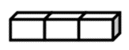
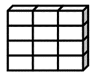
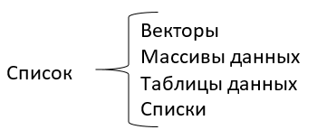

```{r setup, include=FALSE}
knitr::opts_chunk$set(
	message = FALSE,
	warning = FALSE,
	cache = TRUE
)
```

```{r packages, message=FALSE, warning=FALSE}
library(dplyr)
require(ggplot2)
```

## R Markdown

[Detailed Description learnr_page](./learnr_page/learnr_page.html)

Это документ R Markdown. Markdown --- это простой синтаксис
форматирования для создания документов HTML, PDF и MS Word. Для
получения дополнительной информации об использовании R Markdown см.
<http://rmarkdown.rstudio.com>.

Когда вы нажмете кнопку **Knit**, будет сгенерирован документ, который
включает в себя как содержимое, так и выходные данные любых встроенных
фрагментов кода R в документе. Вы можете встроить фрагмент кода R
следующим образом:

```{r cars}
summary(cars)
```

## Добавление диаграмм

Вы также можете вставлять графики, например:

```{r pressure, echo=FALSE}
plot(pressure)
```

Обратите внимание, что параметр `echo = FALSE` был добавлен в фрагмент
кода, чтобы предотвратить печать кода R, сгенерировавшего график.

## Добавление спойлера

Спойлер - это какой-нибудь длиинный дополнительный текст, который по
умолчанию должен быть скрыт. Его можно показать, нажав на спойлер.

<details>

<summary>Спойлер</summary>

Какой-нибудь длиинный дополнительный текст, который по умолчанию должен
быть скрыт. Его можно показать, нажав на спойлер.

</details>

#Использование сочетаний клавиш

Чтобы скопировать текст нажмите <kbd>Ctrl</kbd> + <kbd>C</kbd>

#Использование вкладок

### Вкладки {.tabset}

#### Первая вкладка

Содержимое первой вкладки \#### Вторая вкладка Содержимое второй вкладки
\#### Третья вкладка Содержимое третей вкладки

#Вкладки Вы можете превратить параллельные разделы во вкладки в выводе
`html_document`.

## Results {.tabset}

### Plots

В этом разделе мы показываем точечную диаграмму.

```{r, fig.dim=c(5, 3)}
par(mar = c(4, 4, .5, .1))
plot(mpg ~ hp, data = mtcars, pch = 19)
```

### Tables

Мы показываем данные в этой вкладке.

```{r}
head(mtcars)
```

# Создание набора данных

В этой главе:

-   Изучаем структуры данных в R.

-   Вводим данные.

-   Импортируем данные.

-   Аннотируем наборы данных.

Первый этап любого анализа данных -- создание набора данных, в котором
содержится информация для изучения, в подходящем формате. В R эта задача
распадается на следующие: \* выбор типа данных; \* числовые данные \*
нечисловые данные \* Ввод или импорт данных в выбранном формате.

Первая часть этой главы (разделы 2.1--2.2) содержит описание
многочисленных типов данных, используемых в R. В частности, в разделе
2.2 обсуждаются векторы, факторы, матрицы, таблицы данных и списки.
Знакомство с этими типами данных (и обозначениями, используемыми для
доступа к отдельным их элементам) очень поможет вам в понимании того,
как работает R. Возможно, вы захотите уделить этому разделу достаточно
много времени.

Вторая часть главы (раздел 2.3) посвящена разным способам импорта данных
в R. Данные можно вводить вручную или импортировать из внешнего
источника. Таким источником могут быть текстовые файлы, электронные
таблицы, статистические программы и системы управления базами данных.
Например, я обычно работаю с данными, которые изначально содержатся в
базах данных языка структурированных запросов (Structured Query
Language, SQL). Хотя иногда я получаю данные из старомодных дисковых
операционных систем (Disk Operating System, DOS) и из современных баз
данных SAS и SPSS. Вероятно, вам достаточно будет использовать один или
два метода из описанных в этом разделе, так что просто выберите тот, что
вам подходит. После того как набор данных создан, его, как правило,
нужно аннотировать, добавив подписи для переменных и кодов данных.
Третья часть главы (раздел 2.4) посвящена аннотированию наборов данных и
обзору некоторых полезных функций для работы с ними (раздел 2.5).
Давайте начнем с самого начала.

# Что такое набор данных?

Набор данных -- это, как правило, прямоугольный массив данных, в котором
ряды соответствуют наблюдениям, а столбцы -- признакам. В табл. 2.1
представлен гипотетический набор данных о пациентах.

**Таблица 1.** Набор данных о пациентах

| PatientID | AdmDate    | Age | Diabetes | Status    |
|:----------|:-----------|:----|:---------|:----------|
| 1         | 10/15/2009 | 25  | Type1    | Poor      |
| 2         | 11/01/2009 | 34  | Type2    | Improved  |
| 3         | 10/21/2009 | 28  | Type1    | Excellent |
| 4         | 10/28/2009 | 52  | Type1    | Poor      |

**PatientID** -- порядковый номер пациента; **AdmDate** (admission date)
-- дата поступления: месяц/день/год; **Age** -- возраст; **Diabetes** --
тип диабета (*Type1* -- первый тип, *Type2* -- второй тип); **Status**
-- состояние (*Poor* -- плохое; *Improved* -- улучшившееся; *Excellent*
-- превосходное).

Представители разных профессий по-разному называют строки и столбцы в
наборе данных. Статистики называют их наблюдениями (*observation*) и
переменными (*variable*), аналитики, которые работают с базами данных,
говорят о записях (*record*) и полях (*field*), а те, кто работает в
области нахождения в данных скрытой информации (data mining) и машинного
обучения (machine learning), называют их образцы (*example*) и свойства
(*attribute*).**D** -- это название строки или наблюдения,\
**AdmDate** -- переменная в формате даты,\
**Age** -- непрерывная (или количественная -- continuous) переменная,\
**Diabetes** -- номинальная (nominal) переменная и\
**Status** -- это порядковая (или шкальная -- ordered) переменная.

R работает с самыми разными структурами данных, включая скаляры,
векторы, массивы данных, таблицы данных и списки. Таблица 1 будет
прочитана в R как **таблица данных**. Такое большое разнообразие
поддерживаемых структур дает языку R большую гибкость в работе с
данными.

# Типы данных в R

бывают:

**числовыми** (numeric),\
**текстовыми** (character),\
**логическими** (TRUE/FALSE, правда/ложь),\
**комплексными** (мнимое число) и\
**необработанными** (байты).

Переменные `PatientID`, `AdmDate` и Age будут прочитаны R как числовые,
а `Diabetes` и `Status` -- как текстовые. Еще вам нужно будет «сообщить»
программе, что `PatientID` -- это названия наблюдений, что в `AdmDate`
записаны даты и что `Diabetes` и `Status` -- это номинальная и
порядковая переменные соответственно. В R имена строк называются
**rownames**, а категориальные (номинальные и порядковые) переменные --
**factor** (фактор). Мы рассмотрим все по порядку в следующем разделе.

# Структуры данных

R работает с самыми разными структурами данных, включая скаляры,
векторы, матрицы, массивы данных, таблицы данных и списки. Они
различаются типами данных, способом создания, сложностью устройства, а
также способом обозначать и извлекать их отдельные элементы. Эти
структуры данных схематически изображены на рис. 2.1.

::: {style="text-align: center;"}

:::

а) Вектор

::: {style="text-align: center;"}

:::

б) Матрица

::: {style="text-align: center;"}

:::

в) Массив данных

::: {style="text-align: center;"}

:::

г) Таблица данных

::: {style="text-align: center;"}

:::

д) Список

::: {style="text-align: center;"}

:::

Рис. 2.1. Типы структуры данных в R Структуры данных 55

## Некоторые определения

Существует несколько присущих только R терминов, которые приводят в
замешательство новых пользователей.

В R **объектом** (object) называется все, что может быть представлено в
виде переменных, включая константы, разные типы данных, функции и даже
диаграммы.

У объектов есть *вид* (определяет, в каком виде объект хранится в
памяти) и *класс* (который указывает общим функциям типа print, как с
ним обращаться).

**Таблица данных** (data frame) -- это тип структуры данных в R,
аналогичный тому виду, в котором хранятся данные в обычных
статистических программах (например, в SAS, SPSS и STATA). **Столбцы**
-- это **переменные**, а **строки** -- это **наблюдения**.

В одной таблице данных могут содержаться переменные разных типов
(например, числовые и текстовые). **Таблицы данных** -- это основной тип
структуры данных. **Факторы** -- это номинальные или порядковые
переменные. В R они хранятся и обрабатываются особым образом.

Большинство остальных терминов должны быть вам уже знакомы, они широко
используются в статистике и в вычислениях. Давайте рассмотрим все типы
структуры данных по порядку, начиная с векторов.

# Векторы

**Векторы** (**vector**) -- это одномерные массивы данных, которые могут
содержать числовые, текстовые или логические значения. Для создания
вектора применяется функция объединения `c()`. Вот примеры векторов
каждого типа:

```{r}
a <- c(1, 2, 5, 3, 6, -2, 4) 
b <- c("one", "two", "three") 
c <- c(TRUE, TRUE, TRUE, FALSE, TRUE, FALSE)
```

Здесь **a** -- числовой вектор, **b** -- текстовый вектор, **c** --
логический вектор. Обратите внимание на то, что все элементы вектора
должны быть одного типа (числовые, текстовые или логические). Нельзя
смешивать данные разных типов в одном векторе.

Примечание. Скаляры -- это векторы, состоящие из одного элемента,
например, `f <- 3`, `g <- "US"` и `h <- TRUE`. Они используются для
обозначения констант.

Отдельные элементы вектора можно вызывать при помощи числового вектора,
состоящего из номеров элементов и заключенного в квадратные скобки.
Например, `a[c(2, 4)]` обозначает второй и четвертый элементы вектора
`a`. Вот еще примеры:

```{r}
a <- c(1, 2, 5, 3, 6, -2, 4) 
a[3]
a[c(1, 3, 5)]
a[2:6]
```

Знак двоеточия в последнем примере использован для создания
последовательности чисел. Например, `a <- c(2:6)` -- это то же самое,
что a `<- c(2, 3, 4, 5, 6)`.

# Матрицы

**Матрица** (matrix) -- это двумерный массив данных, в котором *каждый
элемент имеет одинаковый тип* (числовой, текстовый или логический).
Матрицы создают при помощи функции `matrix`. Общий формат таков:

> `mymatrix <- matrix(вектор, nrow=число_строк, ncol=число_столбцов, byrow=логическое_значение, dimnames=list(текст_вектор_названия_строк, текст_вектор_названия_столбцов))`

где `vector` содержит элементы матрицы, `nrow` и `ncol` определяют число
строк и столбцов в матрице, а `dimnames` содержит названия строк и
столбцов (их указывать не обязательно), которые хранятся в виде
текстовых векторов. Параметр `byrow` определяет, как должна заполняться
матрица -- по строкам `(byrow=TRUE)` или по столбцам `(byrow=FALSE)`. По
умолчанию матрица заполняется по столбцам.

Приведенный ниже программный код иллюстрирует применение функции
`matrix`.

Программный код 2.1. Создание матрицы

```{r}
# Создаем матрицу  5х4
y <- matrix(1:20, nrow=5, ncol=4)
y
```

```{r}
# Таблица 2х2 заполнена рядами
cells <- c(1,26,24,68)
rnames <- c("R1", "R2")
cnames <- c("C1", "C2")
mymatrix <- matrix(cells, nrow=2, ncol=2, byrow=TRUE, 
dimnames=list(rnames, cnames))
mymatrix
```

```{r}
# Таблица 2х2 заполнена по столбцам
mymatrix <- matrix(cells, nrow=2, ncol=2, byrow=FALSE,
dimnames=list(rnames, cnames))
mymatrix
```

Сначала вы создаете матрицу 5×4 (#1). Затем вы делаете матрицу 2×2 с
названиями строк и столбцов и заполняете ее по строкам (#2). Наконец, вы
создаете матрицу 2×2 и заполняете ее по столбцам (#3). Вы можете
обозначать строки, столбцы и элементы матрицы при помощи индексов и
квадратных скобок. Например, $X[i,]$ обозначает $i$-ую строку матрицы
$X$, $X[,j]$ -- обозначает ее $j$-ый столбец, а $X[i, j]$ соответствует
элементу этой матрицы, расположенному на пересечении этой строки и этого
столбца. В качестве индексов $i$ и $j$ можно использовать числовые
векторы, чтобы обозначить сразу несколько строк или столбцов, как это
показано ниже.

Программный код 2.2. Использование индексов при работе с матрицами

```{r}
x <- matrix(1:10, nrow=2) 
x
```

```{r}
x[2,]
```

```{r}
x[,2]
```

```{r}
x[1, c(4,5)]
```

```{r}
x[1, c(4,5)]
```

Сначала создана матрица 2×5, содержащая цифры от 1 до 10. По умолчанию
матрица заполнена цифрами по столбцам. Затем выбраны все элементы во
второй строке, а далее -- все элементы во втором столбце. Потом выбран
элемент, который находится в первой строке и в четвертом столбце.
Наконец, выбраны элементы первой строки, которые находятся в четвертом и
пятом столбцах. Матрицы имеют два измерения и, как и векторы, могут
состоять только из одного типа данных. Если есть больше двух измерений,
нужно использовать массивы данных (раздел 2.2.3). Данные разных типов
можно хранить в таблицах (раздел 2.2.3).

# Массивы

Массивы данных (**array**) сходны с матрицами, но могут иметь больше
двух измерений. Массивы данных создаются при помощи функции `array` по
такому образцу:

> `myarray <- array(vector, dimensions, dimnames)`

где **vector** содержит сами данные, **dimensions** -- это числовой
вектор с указанием размерности для каждого измерения, а **dimnames** --
это необязательный список названий измерений.

Ниже в качестве примера представлен программный код, при помощи которого
создан трехмерный (2×3×4) массив чисел.

Программный код 2.3. Создание массива данных

```{r}
dim1 <- c("A1", "A2") 
dim2 <- c("B1", "B2", "B3")
dim3 <- c("C1", "C2", "C3", "C4")
z <- array(1:24, c(2, 3, 4), dimnames=list(dim1, dim2, dim3))
z
```

Очевидно, что массивы данных -- это просто расширенные матрицы. Они
могут быть полезны при написании программ для реализации новых
статистических методов. Как и в матрицах, все элементы массива данных
должны иметь одинаковый тип. Система обозначений элементов здесь такая
же, как для матриц. В приведенном выше примере элемент `z[1,2,3]` -- это
15.

# Таблицы данных

Таблица данных (data frame) -- это более широко используемый по
сравнению с матрицей объект, поскольку разные столбцы могут содержать
разные типы данных (числовой, текстовый и т. д.). Таблица данных -- это
самая часто используемая структура данных в R. Набор данных про
пациентов (табл. 2.1) состоит из числовых и текстовых данных. Эти данные
нужно представить в виде таблицы данных, а не матрицы, поскольку здесь
есть данные разных типов. Таблица данных создается при помощи функции
`data.frame()`:

> `mydata <- data.frame(col1, col2, col3,…),`

где -- `col1`, `col2`, `col3,`... это векторы любого типа (текстового,
числового или логического), которые станут столбцами таблицы. Названия
каждому столбцу можно присвоить при помощи функции names().
Проиллюстрируем сказанное при помощи примера программного кода.

Программный код 2.4. Создание таблицы данных

```{r}
patientID <- c(1, 2, 3, 4)
age <- c(25, 34, 28, 52)
diabetes <- c("Type1", "Type2", "Type1", "Type1")
status <- c("Poor", "Improved", "Excellent", "Poor")
patientdata <- data.frame(patientID, age, diabetes, status)
patientdata
```

Каждый столбец должен содержать данные только одного типа, при этом в
одной таблице данных могут быть столбцы с данными разного типа.
Поскольку таблицы данных очень близки к тому, что аналитики называют
наборами данных, при обсуждении таблиц данных мы будем использовать
термины столбцы и переменные в качестве синонимов.

Существует несколько способов обозначить элементы таблицы данных. Можно
использовать индексы, как мы делали это раньше (например, для матриц),
или можно указывать номера столбцов. Приведенный ниже программный код на
примере созданной раньше таблицы данных `patientdata` демонстрирует оба
способа.

Программный код 2.5. Обозначение элементов таблицы данных

```{r}
patientdata[1:2] 
```

```{r}
patientdata[c("diabetes", "status")] 
```

```{r}
patientdata$age
```

Знак `$` из третьего примера раньше нам не встречался #1. Он
используется, чтобы обозначить определенную переменную в таблице данных.
Например, если вы захотите создать сводную таблицу типов диабета в
зависимости от состояния больного, вы можете использовать следующий
программный код:

```{r}
table(patientdata$diabetes, patientdata$status)
```

Поскольку добавление `patientdata$` перед названием каждой переменной
может быстро надоесть, существуют команды для быстрого вызова
переменной. Для упрощения программного кода можно использовать функции
`attach()` и `detach()` или `with()`.

## Attach, detach и with

Функция `attach()` добавляет указанную таблицу данных к пути поиска R.
Когда указывается имя переменной, программа ищет эту переменную в
таблицах данных, включенных в траекторию поиска. В качестве примера
можно взять таблицу данных mtcars из главы 1, используя следующий
программный код, чтобы узнать основные статистики расхода топлива
(`mpg`), а также изобразить значения этой переменной на диаграмме в
зависимости от рабочего объема цилиндров двигателя (`disp`) и веса
машины (`wt`).

```{r}
summary(mtcars$mpg)
```

```{r}
plot(mtcars$mpg, mtcars$disp)
```

```{r}
plot(mtcars$mpg, mtcars$wt)
```

Это можно также записать в виде

```{r}
attach(mtcars) 
summary(mpg) 
plot(mpg, disp) 
plot(mpg, wt) 
detach(mtcars)
```

Функция `detach()` удаляет таблицу данных из пути поиска. Отметим, что
эта функция ничего не делает с самим объектом. Ввод этой команды
необязателен, но он полезен при программировании, и про него не следует
забывать. Я буду иногда пренебрегать этим мудрым советом в следующих
главах, чтобы сделать приводимые фрагменты программного кода короче и
проще. Ограничение данного метода становится очевидным, если у нас есть
несколько объектов с одинаковыми названиями. Рассмотрим такой
программный код:

```{r ,`include = FALSE`}
#mpg <- c(25, 36, 47)
#attach(mtcars)
#plot(mpg, wt) 
#mpg
```

Когда мы добавили к траектории поиска таблицу данных `mtcars`, в рабочем
пространстве уже имелся объект с названием `mpg`. В подобных случаях
преимущество получает объект, который был создан первым, а это не то,
чего мы хотели. Команда `plot()` не выполняется, потому что `mpg` теперь
состоит из трех элементов, а `d`-- из 32 элементов.

Функции `attach()` и `detach()` лучше всего использовать, когда вы
работаете с одной таблицей данных, и вероятность того, что у вас будет
несколько объектов с одинаковыми именами, мала.

В любом случае обращайте внимание на предупреждения о том, что объекты
маскируются одноименными объектами (`objects are masked`) (То есть
становятся недоступными для непосредственного вызова. -- Прим. пер.).
Альтернативный подход заключается в использовании функции `with()`.
Предыдущий пример можно записать так:

`with(mtcars, { summary(mpg, disp, wt) plot(mpg, disp) plot(mpg, wt) })`

В этом случае команды внутри фигурных скобок относятся к таблице данных
mtcars. Теперь нам не придется заботиться о конфликте названий. Если
нужно выполнить только одну команду (например, s`ummary(mpg))`, фигурные
скобки необязательны. Ограничение функции `with()` заключается в том,
что она не действует за пределами фигурных скобок. Рассмотрим следующий
пример:

```{r}
with(mtcars, {
summary(mpg, disp, wt)
plot(mpg, disp)
plot(mpg, wt)
})
```

Если требуется создать объекты, которые будут существовать вне
конструкции `with()`, используйте специальный символ присвоения `<<-`
вместо обычного `(<-)`. Этот прием позволит сохранить созданный объект в
рабочем пространстве вне конструкции `with()`. Это можно показать на
примере такого программного кода:

```{r}
#with(mtcars, { 
#nokeepstats <- summary(mpg)
#keepstats <<- summary(mpg)
#})
#nokeepstats
#keepstats
```

В большинстве руководств по R рекомендуется использовать `with()`, а не
`attach()`. Я думаю, что выбор зависит от индивидуальных предпочтений и
должен основываться на том, чего вы хотите достичь. В этой книге мы
будем использовать обе команды.

### Названия строк

В примере с данными о больных столбец `patientID` использовался для
обозначения отдельных людей в наборе данных. В R названия строк могут
быть назначены при помощи параметра `rowname` функции создания таблицы
данных. Например, программный код

```{r}
patientdata <- data.frame(patientID, age, diabetes,
status,row.names=patientID)
```

назначает `patientID` переменной, которая будет использоваться для
обозначения строк при выводе данных и создании диаграмм в R.

# Факторы

Как мы уже узнали, переменные бывают **номинальными**, **порядковыми**
или **непрерывными**. **Номинальные переменные** -- это категориальные
данные, которые невозможно упорядочить.

Переменная `Diabetes` -- это пример номинальных данных. Даже если мы
обозначим `Type 1` (тип 1) единицей, а `Type 2` (тип 2) -- двойкой, все
равно эти цифры нельзя будет сравнивать в терминах «больше -- меньше».
**Порядковые** данные можно упорядочить, но не оценить количественно.

Переменная `Status` -- хороший пример порядковых данных. Понятно, что у
больного с плохим (poor) самочувствием дела идут не так хорошо, как у
больного, чье состояние улучшилось (improved), но не ясно, насколько.

**Непрерывные** переменные могут принимать любое значение в пределах
определенного диапазона. Их значения можно упорядочить и понять,
насколько одно из них больше другого. Возраст, выраженный в годах,
является непрерывной переменной и может принимать такие значения, как
14.5 или 22.8, а также любые значения между этими двумя.

Вы знаете, что пятнадцатилетний подросток старше четырнадцатилетнего на
один год. **Категориальные** (номинальные и порядковые) данные
называются в R **факторами**. Факторы очень важны в R, поскольку они
определяют, как данные будут проанализированы и графически представлены.
Вы будете видеть примеры этого на протяжении всей книги.

Функция `factor()` сохраняет категориальные данные в виде вектора из
целых чисел в диапазоне от одного до `k` (где `k` -- число уникальных
значений категориальной переменной) и в виде внутреннего вектора из
цепочки символов (исходных значений переменной), соответствующим этим
целым числам.

К примеру, представьте, что у вас есть вектор
`diabetes <- c("Type1", "Type2", "Type1", "Type1")`. Команда
`diabetes <- factor(diabetes)` преобразует этот вектор в `(1, 2, 1, 1)`
и устанавливает внутреннее соответствие 1=Type1 и 2=Type2 (присвоение
числовых значений происходит в алфавитном порядке).

Любой анализ, который вы будете проводить с вектором diabetes, будет
воспринимать эту переменную как номинальную и выбирать статистические
методы, подходящие для этого типа данных. При работе с векторами,
которые представлены порядковыми данными, для функции factor() нужно
добавлять параметр ordered=TRUE.

Примененная к вектору
`status <- c("Poor", "Improved", "Excellent", "Poor")` команда
`status <- factor(status, ordered=TRUE)` преобразует этот вектор в вид
`(3, 2, 1, 3)` и установит внутреннее соответствие как
`1=Excellent, 2=Improved, 3=Poor`.

Во время любой обработки этого вектора он будет воспринят как порядковая
переменная с применением соответствующих статистических методов. По
умолчанию уровни фактора присваиваются значениям вектора в алфавитном
порядке. Это сработало для фактора status, поскольку порядок
`"Excellent", "Improved", "Poor"` имеет смысл.

Если бы вместо "Poor" стояло "Ailing" (чахнущий), то возникло бы
затруднение, поскольку тогда порядок был бы такой:
`"Ailing", "Excellent", "Improved"`.

Сходная проблема возникла бы, если бы нам был нужен такой порядок:
`"Poor", "Improved", "Excellent"`. Для упорядоченных факторов редко
подходит алфавитный порядок уровней, предлагающийся по умолчанию.
Установку по умолчанию можно изменить при помощи параметра levels.
Например,

```{r}
status <- factor(status, order=TRUE,
levels=c("Poor", "Improved", "Excellent"))
```

присвоит уровни значениям вектора следующим образом:
`1=Poor, 2=Improved, 3=Excellent`. Проверьте, что все присвоенные уровни
соответствуют реальным значениям данных. Все значения данных, которые не
были указаны, будут обозначены как отсутствующие. Приведенный ниже
программный код показывает, как назначение факторов и упорядоченных
факторов влияет на анализ данных.

Программный код 2.6. Использование факторов

```{r}
#1 Вводим данные как векторы
patientID <- c(1, 2, 3, 4) 
age <- c(25, 34, 28, 52)
diabetes <- c("Type1", "Type2", "Type1", "Type1")
status <- c("Poor", "Improved", "Excellent", "Poor")
diabetes <- factor(diabetes)
status <- factor(status, order=TRUE)
patientdata <- data.frame(patientID, age, diabetes, status)
```

```{r}
#2 Смотрим структуру объекта
str(patientdata)
```

```{r}
#3 Смотрим сводную статистику для объекта
summary(patientdata)
```

Сначала вы вводите данные как векторы (#1). Затем вы указываете, что
`diabetes` -- это фактор, а status -- это упорядоченный фактор. Наконец,
вы объединяете данные в таблицу.

Функция `str(object)` выводит информацию об объекте (в нашем случае это
таблица данных) (#2). Ясно видно, что `diabetes` -- это фактор, а
`status` -- это упорядоченный фактор; также указано, как он закодирован
внутри программы. Обратите внимание, что функция `summary()`
обрабатывает переменные по-разному (#3).

Для непрерывной переменной age вычислены **минимум** (`minimum, Min.`),
**максимум** (`maximum, Max`.), **среднее** (`Mean`) и **квартили**
(f`irst and third quartiles: 1st Qu., 3rd Qu.`), а для категориальных
переменных `diabetes` и `status` подсчитана частота встречаемости
каждого значения.

# Списки

**Списки** -- это самый сложный тип данных в R. Фактически список -- это
упорядоченный набор объектов (компонентов). Список может объединять
разные (возможно, не связанные между собой) объекты под одним именем. К
примеру, список может представлять собой сочетание векторов, матриц,
таблиц данных и даже других списков. Список можно создать при помощи
функции list():

> `mylist <- list(объект 1, объект 2, …),`

где объекты -- это любые структуры данных, которые мы обсуждали до
этого. Объектам в списке можно присваивать имена:

> `mylist <- list(name1= объект 1, name2= объект 2, …)`.

Пример работы со списками приведен ниже.

**Программный код 2.7**. Создание списка

```{r}
g <- "My First List"
h <- c(25, 26, 18, 39)
j <- matrix(1:10, nrow=5)
k <- c("one", "two", "three")
```

```{r}
#1 Создаем список 
mylist <- list(title=g, ages=h, j, k)
```

```{r}
#2 Выводим на экран весь список
mylist
```

```{r}
#3 Выводим на экран второй объект списка
mylist[[2]]
```

```{r}
mylist[["ages"]]
```

В приведенном примере вы создаете список из четырех компонентов:
тестовая строка, числовой вектор, матрица и текстовый вектор. В виде
списка можно сохранять любое число объектов. Можно обозначать элементы
списка, указав их номер или название внутри двойных квадратных скобок.

В этом примере и `mylist[[2]]`, и `mylist[["ages"]]` обозначают один и
тот же числовой вектор из четырех элементов. Списки -- это важный тип
структуры данных в R по двум причинам. Во-первых, они позволяют вам без
труда упорядочить и вызвать на экран разрозненную информацию. Во-вторых,
результаты выполнения многих команд представляют собой списки. В этом
случае пользователь извлекает из таких списков нужную информацию. Вы
сможете увидеть многочисленные примеры функций, которые возвращают
списки, в следующих главах.

#### **Информация для программистов**

Для многих профессиональных программистов некоторые аспекты языка R
кажутся необычными. Вот несколько особенностей языка R, о которых вам
следует помнить:

-   точка (`.`) в названиях объектов не имеет никакого специального
    значения. Однако знак доллара (`$`) имеет примерно такое же
    значение, как точка в других языках программирования, обозначая
    часть объекта. Например, `A$x` обозначает переменную x в таблице
    данных `A`;
-   в R нет возможности создавать многострочные или блочные комментарии.
    Каждую строку комментария нужно начинать со знака `#`. При отладке
    программных кодов можно заключать участок кода, который должен быть
    пропущен программным интерпретатором, внутрь конструкции
    `if(FALSE){…}`. Замена `FALSE` на `TRUE` сделает возможным
    выполнение кода;
-   присвоение значений несуществующему элементу вектора, матрицы,
    массива данных или списка расширит существующий объект, чтобы
    вместить новое значение.

Рассмотрим следующий пример:

```{r}
x <- c(8, 6, 4)
x[7] <- 10
x
```

В результате присвоения размер вектора x увеличился с трех до семи
элементов;

-   в R нет скаляров. Они представлены в виде вектора, состоящего из
    одного элемента;

-   нумерация в R начинается с `1`, а не с `0`. В приведенном выше
    векторе элемент `x[1]` -- это `8`.

Дальнейшую информацию можно получить в превосходном блоге Джона Кука
(John Cook) «Программирование в R для тех, кто раньше работал с другими
языками» (www.johndcook.com/R_language_for_programmers.html).

Программисты, которым нужно руководство по стилю программирования, также
могут заглянуть в «Руководство по стилю программирования в R» от Google
(<http://google-styleguide.googlecode.com/svn/trunk/google-r-style.html>).
